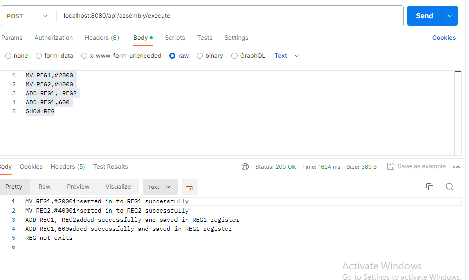

# Assembly Program

## Overview

This project is a Spring Boot application for executing assembly-like instructions through a REST API.

## Prerequisites

Before you begin, ensure you have the following installed on your machine:
- [Git](https://git-scm.com/)
- [Docker](https://www.docker.com/)

## Setup Instructions

### 1. Clone the Repository

Open a terminal and run the following command to clone the repository:

```bash
git clone https://github.com/ramanadas/assembly-program.git
cd assembly-program
docker-compose up --build


```

### 2. Build and Run the Application

Use Docker Compose to build and run the application:

```bash
docker-compose up --build
```

This command will:
- Build the Docker images for the application and MySQL database.
- Start the services defined in the `docker-compose.yml` file.

### 3. Access the Application

Once the application is up and running, it will be available at:

```
http://localhost:8080
```

### Sample API Request

You can use tools like [Postman](https://www.postman.com/) or `curl` to test the API. Here's an example using `curl`:

#### Endpoint:
```
POST http://localhost:8080/api/assembly/execute
```

#### Request Body:
Send the following assembly instructions as a string in the request body:

```
MV REG1,#2000
MV REG2,#4000
ADD REG1, REG2
ADD REG1,600
SHOW REG
```

#### Example `curl` Command:

```bash
curl -X POST http://localhost:8080/api/assembly/execute -H "Content-Type: text/plain" -d "MV REG1,#2000\nMV REG2,#4000\nADD REG1, REG2\nADD REG1,600\nSHOW REG"
```

## Additional Configuration

If your application requires additional configuration, such as environment variables or specific network settings, include those details here. For example, you might need to set up database credentials or other secrets.

## Troubleshooting

If you encounter any issues while setting up or running the application, consider the following steps:

1. **Check Docker Logs:**
   ```bash
   docker-compose logs
   ```

2. **Verify Prerequisites:**
   Ensure you have the correct versions of Git and Docker installed.

3. **Common Issues:**
   - **Port Conflicts:** Ensure port 8080 is available and not used by other applications.
   - **Network Issues:** Verify that Docker can access the internet to pull necessary images.

For further assistance, please open an issue in the [GitHub repository](https://github.com/ramanadas/assembly-program/issues).
